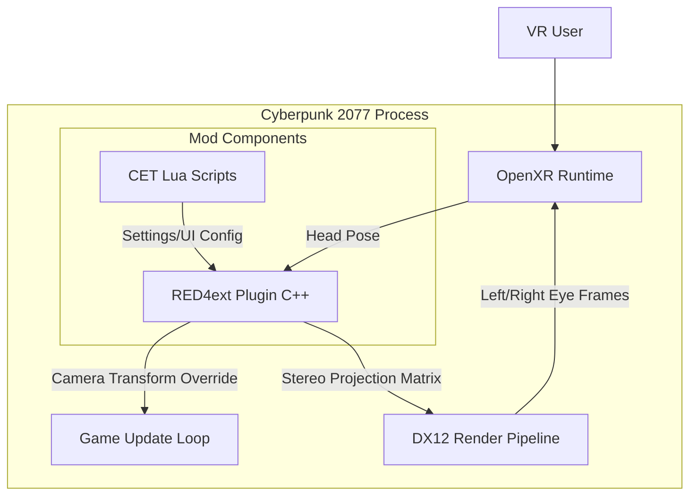

# Cyberpunk 2077 Open Source VR Mod - Technical Specification

## 1. Overview
**Project Name:** Cyberpunk 2077 Open Source VR Mod (Project Name TBD)
**Goal:** Create a free, open-source VR mod for Cyberpunk 2077 that provides stereoscopic 3D rendering, head tracking, and VR controller support.
**License:** Open Source (GPLv3 or MIT).
**Target Engine:** REDengine 4 (Cyberpunk 2077).
**Graphics API:** DirectX 12.

### 1.1 Legal Compliance
**Strict Non-Commercial Policy:**
To fully comply with [CD PROJEKT RED's Fan Content Guidelines](https://cdprojektred.com/en/fan-content):
*   This project is and will always be **100% free** to download.
*   No features will be paywalled or locked behind subscriptions (e.g., Patreon).
*   Voluntary donations (Ko-fi, GitHub Sponsors) are permitted *only* if they do not unlock content, strictly adhering to the "non-commercial" requirement that triggered previous DMCA takedowns for other mods.

## 2. Architecture & Tech Stack

The solution leverages existing modding infrastructure to minimize reverse-engineering efforts.

### 2.1 Core Components
1.  **RED4ext Plugin (C++)**:
    -   **Role:** The core "driver" of the mod.
    -   **Function:** Hooks into the game engine's update loop to manipulate the camera, intercept rendering calls, and handle VR initialization.
    -   **Dependency:** [RED4ext.SDK](https://github.com/WopsS/RED4ext.SDK) (Provides reverse-engineered game types).
    
2.  **OpenXR Integration**:
    -   **Role:** Standardized interface for VR hardware (Oculus, Index, Quest, etc.).
    -   **Function:** Handles head tracking data acquisition, frame submission to the headset, and input polling.
    -   **Implementation:** Statically or dynamically linked OpenXR loader within the RED4ext plugin.

3.  **Cyber Engine Tweaks (CET) Scripts (Lua)**:
    -   **Role:** High-level logic and UI.
    -   **Function:** Handles in-game settings menus (IPD, quality options), UI/HUD repositioning adjustments, and potentially fix toggles.
    -   **Dependency:** [Cyber Engine Tweaks](https://github.com/yamashi/CyberEngineTweaks).

4.  **Rendering Hook / Shader Injector**:
    -   **Role:** Graphics pipeline manipulation.
    -   **Function:** Intercepts DirectX 12 `Present` and Draw calls to implement the stereo rendering logic.
    -   **Potential Tools:** 
        -   Custom DX12 hooks within the RED4ext plugin (Preferred for tight integration).
        -   **3Dmigoto** (if deep shader replacements are needed).

### 2.2 System Architecture Diagram

## 3. Implementation Details

### 3.1 Stereoscopic Rendering Strategy
**Method:** Alternate Eye Rendering (AER).
*   **Rationale:** Simultaneous Rendering (Geometry Shader duplication or multi-viewport) is extremely performance-intensive for CP2077. AER allows the game to run at ~90fps (45fps per eye effective) while keeping system requirements manageable.
*   **Workflow:**
    *   **Frame N (Left):** 
        1.  Plugin intercepts Camera Update.
        2.  Applies Left Eye Offset (`-IPD/2`).
        3.  Adjusts Projection Matrix (asymmetric frustum).
        4.  Game renders frame.
        5.  Plugin intercepts frame completion -> Submits to OpenXR Left Eye layer.
    *   **Frame N+1 (Right):**
        1.  Plugin intercepts Camera Update.
        2.  Applies Right Eye Offset (`+IPD/2`).
        3.  Adjusts Projection Matrix.
        4.  Game renders frame.
        5.  Plugin intercepts frame completion -> Submits to OpenXR Right Eye layer.
    *   **Reprojection:** The OpenXR runtime (SteamVR/Oculus) handles "filling in" the missing eye for each frame using reprojection/timewarp, smoothing out the experience.

### 3.2 Camera Hooks
*   **Target:** `worldRenderView` or specific Camera System classes in REDengine.
*   **Mechanism:**
    *   Locate the camera data structure in memory using RED4ext.SDK.
    *   Overwrite the `Position` and `Orientation` (Quaternion/Euler) just before the frame render starts.
    *   **Crucial:** Decouple "Game Body" yaw from "Head" yaw to allow looking around without turning the character (unless aiming).

### 3.3 UI & HUD
*   **Problem:** Standard UI is screen-space (2D) and will look wrong/unreadable in VR.
*   **Solution:**
    *   **Option A (Projected):** Render the UI to an off-screen texture (if possible via simple hooks) and display it on a 3D quad in world space.
    *   **Option B (Depth):** Push the UI depth value far back so it renders "at a distance" rather than on the nose.
    *   **Option C (CET):** Use CET to move individual UI elements if the game exposes their coordinates (e.g., Mini-map, Ammo counter) to better "floating" positions.

### 3.4 Input Handling
*   **Phase 1:** Gamepad / Keyboard & Mouse support (Head aiming).
*   **Phase 2:** 6DOF Controller support.
    *   Map OpenXR controller pose to "Weapon" bone or IK target in game.
    *   Requires hooking the Animation System (e.g., `animRig` or `weaponBone`).

## 4. Development Roadmap

### Phase 1: Foundation (Weeks 1-3)
*   [ ] Set up RED4ext plugin build environment.
*   [ ] Initialize OpenXR and establish connection to headset.
*   [ ] Locate Camera Data structures via RED4ext.SDK.
*   [ ] **Milestone:** "Hello VR" - Log head tracking data to console while running the game.

### Phase 2: The View (Weeks 4-7)
*   [ ] Implement Camera Override hook.
*   [ ] Map Head Tracking -> Game Camera.
*   [ ] Implement basic AER loop (toggle eye offset every frame).
*   [ ] **Milestone:** Stereoscopic 3D rendering (visuals may be buggy/UI broken).

### Phase 3: Integration (Weeks 8-10)
*   [ ] Fix Projection Matrices (culling edges, correct FOV).
*   [ ] Handle UI projection (or disable interfering UI elements).
*   [ ] Add CET Settings menu (IPD slider, Reset View button).
*   [ ] **Milestone:** Playable Alpha.

### Phase 4: Polish (Weeks 11+)
*   [ ] Performance optimization (remove unnecessary render passes if possible).
*   [ ] Address "Edge Cases" (Vehicle camera, Cutscenes, Brain Dances).
*   [ ] Community Testing & Bug Fixes.

## 5. References & Resources
*   **RED4ext SDK:** [https://github.com/WopsS/RED4ext.SDK](https://github.com/WopsS/RED4ext.SDK)
*   **Cyber Engine Tweaks:** [https://github.com/yamashi/CyberEngineTweaks](https://github.com/yamashi/CyberEngineTweaks)
*   **OpenXR Specification:** [https://www.khronos.org/registry/OpenXR/](https://www.khronos.org/registry/OpenXR/)
*   **Reference Implementation (Conceptual):** Luke Ross R.E.A.L. Mods (Closed source, but widely analyzed).
*   **Reference Architecture:** Praydog UEVR (Open Source - useful for OpenXR handling patterns).
